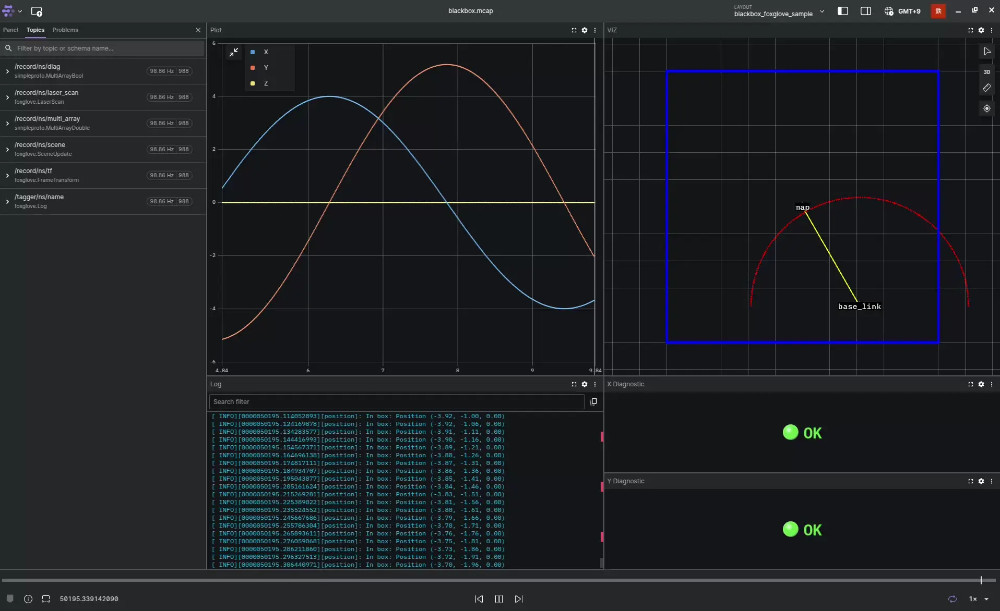

# BlackBox-Cpp

**BlackBox-Cpp** は、もともと ROS2 用に開発されたロギングライブラリ [BlackBox](https://github.com/Ayrton2718/blackbox.git) を ROS2 に依存しない形に改良したものです。  
このライブラリを使うことで、ROS2 を使用しなくても **Mcap-Protobuf 形式** の rosbag ファイルを作成できます。

BlackBox-Cpp を活用すれば、さまざまな種類のログをひとつの rosbag ファイルにまとめて保存できます。たとえば：
- 実行時のコンソールログ
- アプリケーションが生成する独自メッセージ
- 可視化のためのログデータ

作成した rosbag ファイルは、クロスプラットフォーム可視化ツールである [Foxglove Studio](https://foxglove.dev/) を使って解析・可視化できます。

[example.cpp](example/example.cpp)


## Foxglove Studio について

**Foxglove Studio** は、`.mcap` ファイルを直接開いて解析できる多機能ツールです。  
**Windows**、**Mac**、さらにスマートフォンの **Web ブラウザ** からも利用できます。

また、Foxglove Studio は日本語に対応しており、設定メニューから言語を日本語に変更できます。  
さらに、再生時のフレームレートも設定画面で調整可能です。

詳しくは以下のリンクからアプリケーションをダウンロードしてください：  
[Foxglove Studio のインストール](https://foxglove.dev/download)

## Get Started
[自分のCMake_Workspaceに追加する](#use-blackbox-cpp-in-your-workspace)

BlackBox commandのインストール
```bash
sudo apt install -y ansible
git clone https://github.com/Ayrton2718/blackbox.git
cd blackbox
ansible-playbook --ask-become-pass ansible/dev.yml
```

ビルド＆RUN
```bash
conan install . --build=missing -sbuild_type="$BUILD_TYPE"
./build.sh
./run.sh
```

うまく行けば、`/var/tmp/blackbox_archive`にログが保存されているはずです。
(archiveがうまく行かなかった場合は、`/tmp/blackbox_log`に格納されます)

ログが開けたら、サンプルの動画のような、パネルのレイアウトをFoxgloveにロードさせます。
- [Sample layout File](example/blackbox_foxglove_sample.json)
- [Import Layout](https://docs.foxglove.dev/docs/visualization/layouts#import-and-export)

## How To Use
このライブラリは、`BlackBox` のインスタンスを作成して使用します。  
サンプルでは、次のように `BlackBox` を生成しています。

```cpp
// BlackBoxNode インスタンス作成
blackbox::BlackBox bb_node("namespace", "node_name", blackbox::debug_mode_t::DEBUG);
```

### Logger
実行時のメッセージは Logger を使って記録します。  
ログには、レベル（重要度）とタグを設定できます。  
記録されたログは `/tagger/namespace/node_name` に格納され、**Foxglove Studio の Log パネル**で確認できます。

[Foxglove Log パネルのドキュメント](https://docs.foxglove.dev/docs/visualization/panels/log)

例：

```cpp
blackbox::Logger info;
info.init(&bb_node, blackbox::log_type_t::INFO, "position");

blackbox::Logger error;
error.init(&bb_node, blackbox::log_type_t::ERR, "over_position");

TAGGER(&info, "In box: Position (%.2f, %.2f, %.2f)", x, y, z);
TAGGER(&error, "Out of box: Position (%.2f, %.2f, %.2f)", x, y, z);
```

> **ポイント：** `BlackBox` のデバッグモードを設定することで、コンソール出力の有無を切り替えることができます。

```cpp
// デバッグモード：コンソール出力 + 記録
blackbox::BlackBox(blackbox::debug_mode_t::DEBUG, "node_name", "namespace");

// リリースモード：記録のみ
blackbox::BlackBox(blackbox::debug_mode_t::RELEASE, "node_name", "namespace");
```

ログレベル：
```cpp
enum log_type_t{
    ERR,            // 常にレコード、Debug modeはSTDOUT
    WARN,            // 常にレコード、Debug modeはSTDOUT
    INFO,            // 常にレコード、 Debug modeはSTDOUT
    DEBUG,          // Debug modeのときだけレコード + STDOUT
};
```

### Recorder

数値データなどのメッセージは **レコーダー** を使って記録します。  
記録したデータは **Foxglove Studio の Plot パネル** で可視化したり、`.mcap` ファイルとして保存し後から解析することができます。

データは `/record/namespace/node_name` に保存されます。

例：

```cpp
blackbox::Record<foxglove::FrameTransform> frame_record;
frame_record.init(&bb_node, "/tf");

auto frame_msg = create_frame_transform_msg(x, y, z);
frame_record.record(std::move(frame_msg));
```

レコードできる型は、Foxgloveのprotobuf msgです。(https://github.com/foxglove/foxglove-sdk/tree/main/schemas/proto/foxglove)  
Foxgloveのprotobufで保存したデータは、Foxglove studioでデフォルトで用意されている[Panel](https://docs.foxglove.dev/docs/visualization/panels/introduction)で可視化できます。

また、自分で作成したprotobuf型をレコードすることができます。
例）[simpleproto](proto/simpleproto)

## Sample Code

このサンプルアプリケーションでは次の処理を行います：
- 円運動をシミュレーション
- 現在位置をログ出力
- 各種データを記録
  - `FrameTransform`：座標変換
  - `SceneUpdate`：環境情報
  - `LaserScan`：レーザースキャン
  - `MultiArrayDouble` / `MultiArrayBool`：診断データ

実行後、自動的に `.mcap` 形式でデータが保存されます。

完全なサンプルコードはこちら：  
[example.cpp](example/example.cpp)


## Management Log Files & BlackBox commands
直近のログファイルは`/tmp/blackbox_log`に保存されます。  
過去のログは`/var/tmp/blackbox_archive`に保存されます。 

下記に、ログフォルダのcreate, archive, mergeのコマンドを紹介します。
これらのコマンドは、ansibleによりインストールされます。

### blackbox_create command
ログファイルの保存場所`/tmp/blackbox_log`を作成します。  
**プログラムの実行前に必ずこのコマンドを実行する必要があります。**
起動用のBashファイルを作ることを推奨します。

```shell
#!/bin/bash
blackbox_create
./build/Release/example.out
```

### blackbox_archive command
ログファイル`/tmp/blackbox_log`を`/var/tmp/blackbox_archive`に移動させます。
50件以上のアーカイブがあると、一番古いものが削除されていきます[件数の変更方法](ansible/roles/blackbox/script/blackbox_archive)。

`BLACKBOX`という名前の外部ディスクが`/media/$USER/BLACKBOX`にあると、そちらに保存されるようになります。

```shell
#!/bin/bash
blackbox_archive
blackbox_create
./build/Release/example.out
```

注意点としては、ログファイルの大きさによっては、`blackbox_archive`に時間がかかる可能性があります。  
対策として、プログラム終了時に、`run.sh`やsystemdなどでサービス終了時にアーカイブすることを推奨します。

```shell
#!/bin/bash

# クリーンアップ関数を定義
cleanup() {
    echo "CTRL-C を検知しました。ログをアーカイブします..."
    blackbox_archive
    exit 1
}

# SIGINT（CTRL-C）を捕まえてクリーンアップ関数を呼ぶ
trap cleanup SIGINT

blackbox_create
./build/Release/example.out
blackbox_archive
```

```systemd
[Unit]
Description=Robot Launcher

[Service]
User=user
Group=user
Type=simple
ExecStartPost=/usr/bin/blackbox_create
ExecStart=/bin/bash -c '\
    ./home/user/a.out'
ExecStop=/bin/bash -c '/bin/kill -SIGINT ${MAINPID} && sleep 1s'
ExecStopPost=/usr/bin/blackbox_archive

Restart=on-failure
StartLimitBurst=3
KillMode=control-group
TimeoutStopSec=5s
RestartSec=10s
RemainAfterExit=false

[Install]
```


### blackbox_merge command
`/tmp/blackbox_log`にある、ノードごとに分かれているMcapを一つにまとめることができます。  
一つになったmcapファイルは、`merged.mcap`として出力されます。

最後に実行したものに対して行う
```bash
blackbox_merge '/tmp/blackbox_log' 
```
過去のBlackBoxに対して
```bash
blackbox_merge '/var/tmp/blackbox_archive/blackbox_2024-03-24_21-24-14' 
```
現在のディレクトリに対して
```bash
blackbox_merge .
```
## Using BlackBox-Cpp in Your Workspace

### 1. Install Conan Libraries

Navigate to your workspace directory and run the installation script:

```shell
cd ~/<path-to-your-workspace>/<library-path>
git clone https://github.com/Ayrton2718/blackbox-cpp.git　<library-path>/blackbox-cpp
bash <library-path>/blackbox-cpp/conan_install.sh
```

If you are using **Ninja** as the build system, use the following command:

```shell
bash <library-path>/blackbox-cpp/conan_install.sh -n
```

---

### 2. Add BlackBox to your CMake file

Include the BlackBox directory in your `CMakeLists.txt`:

```cmake
add_subdirectory(<library-path>/blackbox-cpp)

target_link_libraries(<target> PUBLIC
    blackbox
)
```

---

### 3. Configure CMake with Conan Toolchain

Add the `-DCMAKE_TOOLCHAIN_FILE=generators/conan_toolchain.cmake` option to your CMake command:

```shell
cmake -DCMAKE_BUILD_TYPE=Release -S . -B build/Release -DCMAKE_TOOLCHAIN_FILE=generators/conan_toolchain.cmake
cmake --build ./build/$BUILD_TYPE
```
